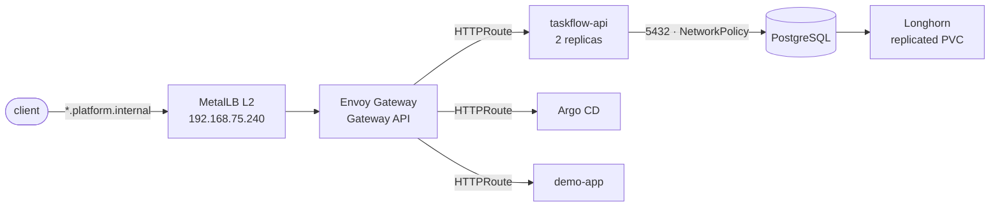
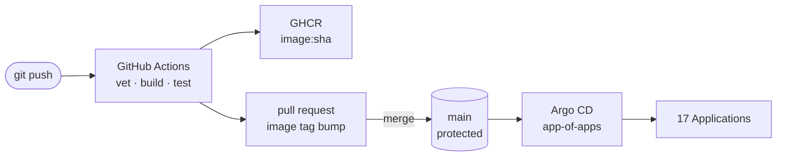
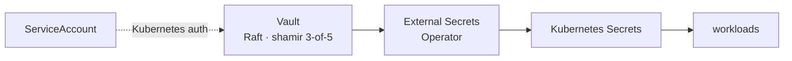

# production-kubernetes-platform

A three-node Kubernetes cluster built by hand with kubeadm and operated as a real
platform: GitOps delivery, secrets from Vault, replicated storage, backups that
have actually been restored, and monitoring that has caught real failures.

It runs on a laptop. What makes it worth reading is not the component list — it
is the two incidents it survived, the measurements taken during them, and the
risks accepted on purpose rather than by accident.

## Incidents

Both are blameless write-ups with timelines, evidence and action items.

| Date | What happened | Root cause |
|---|---|---|
| [2026-09-18](docs/incidents/2026-09-18-etcd-corruption.md) | etcd would not start; `etcdutl snapshot status` failed with `nil bucket` | Structural damage from a hand-rebuilt bbolt database. Recovered with a staged live swap, 47s of downtime |
| [2026-09-25](docs/incidents/2026-09-25-host-sleep.md) | Longhorn volumes remounted read-only, control plane flapped | Host entered S3 sleep with VMs running. VMware could not complete guest I/O across the suspend. No data lost |

The second produced numbers worth keeping: etcd WAL fsync p99 of **1,341 ms**
under rebuild load against **15 ms** at idle, and 47 `kube-controller-manager`
restarts caused entirely by missed leader-election leases.

## Request path



`default-deny-all` is in force in the application namespace; every allowed flow
is an explicit NetworkPolicy.

## Delivery path



CI cannot push to `main` — it opens a pull request instead. The reasoning is in
[ADR-002](docs/adr/ADR-002-gitops.md), along with why the Argo CD root
self-heals but does not prune.

## Secrets



No secrets in Git. The Vault root token is revoked; ESO authenticates with a
Kubernetes ServiceAccount against a least-privilege policy.

## What runs here, and why

| Layer | Choice | Why this one |
|---|---|---|
| Cluster | kubeadm 1.36.3, Ubuntu 24.04, containerd 2.2.1 | Built by hand rather than with a distro, to learn the parts |
| CNI | Flannel | VXLAN, simple, sufficient — the interesting problems here are not networking |
| Ingress | Envoy Gateway + Gateway API | Gateway API rather than Ingress; namespace-aware routing with explicit `allowedRoutes` |
| Load balancer | MetalLB (L2), `192.168.75.240-250` | No cloud LB on a laptop |
| Storage | Longhorn | Replicated block storage; survived a node loss and rebuilt itself |
| GitOps | Argo CD, app-of-apps | 17 Applications, `main` as the only source of truth |
| Secrets | Vault + External Secrets Operator | Credentials live in Vault; Kubernetes Secrets are rendered, never committed |
| TLS | cert-manager, internal CA | Real certificate lifecycle without public DNS |
| Monitoring | kube-prometheus-stack, Loki, Alertmanager → Discord | Alerts on etcd disk latency, quota, backups and Argo drift |
| Backup | Velero + MinIO (Kopia), etcd snapshots encrypted with `age`, pulled off-cluster | Restores have been executed, not assumed |
| CI | GitHub Actions → GHCR | Protected `main`, required status check |
| Application | taskflow-api (Go) + PostgreSQL | Something real to deploy, break and restore |

## Operations

| Runbook | |
|---|---|
| [etcd backup and restore](docs/runbooks/etcd-backup-restore.md) | Including scheduled defragmentation and the quota trap |
| [Lab startup and shutdown](docs/runbooks/lab-startup-shutdown.md) | Staged order, and why the host must not sleep |
| [Secret rotation](docs/runbooks/secret-rotation.md) | Finding every consumer before rotating |

## Accepted risks

Deliberate, with compensating controls — see
[PROJECT_STATE.md](docs/PROJECT_STATE.md).

- **Single control-plane node.** Not fixable on one laptop. Mitigated by
  6-hourly encrypted etcd backups, verified restorable off-cluster.
- **etcd on a spinning disk.** Adequate at idle, collapses under concurrent
  load. Mitigated by latency recording rules, a critical alert, and raised
  leader-election deadlines. The real fix is an SSD.

## Repository layout

```text
apps/taskflow-api/          Go application source
docs/
  adr/                      architecture decisions
  incidents/                postmortems
  runbooks/                 operational procedures
infrastructure/
  ansible/                  host configuration, backups, defrag, tuning
  laptop/                   host power policy and off-site backup pull
  vault/                    policies and bootstrap
kubernetes/
  applications/             workloads
  gitops/argocd/            one Argo CD Application per component
  gitops/bootstrap/         the root Application, applied by hand
  platform/                 wrapper charts with vendored dependencies
```

## Status

Actively run and actively broken. The postmortems are the point.
